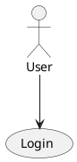

# PlantUML to Draw.io Converter

A Node.js tool to convert PlantUML Use Case diagrams into Draw.io XML format for easy editing and visualization.

## Features

- Parses PlantUML Use Case syntax (actors, use cases, relationships)
- Automatically lays out diagrams using Dagre for clean positioning
- Outputs standard Draw.io XML that can be opened directly in Draw.io
- Supports basic actor and use case elements with connecting edges

## Installation

1. Clone or download this repository
2. Install dependencies:
   ```bash
   npm install
   ```

## Usage

Run the converter with a PlantUML file:

```bash
node converter.js <input.puml> [-o <output.drawio>]
```

- `<input.puml>`: Path to your PlantUML file
- `-o <output.drawio>`: Optional output file path (defaults to `output.drawio`)

## PlantUML Syntax Support

The converter supports basic Use Case diagram elements:

- Actors: `actor "Name" as ID` or `:Name:`
- Use Cases: `usecase "Description" as ID` or `(Description)`
- Relationships: `Actor --> UseCase` or `UseCase --> UseCase`

Example PlantUML file:


## Examples

Several example diagrams are included:

- `sample.puml` - Basic login system
- `library.puml` - Library management
- `shopping.puml` - Online shopping with extends/includes
- `banking.puml` - Banking operations
- `hospital.puml` - Hospital management
- `restaurant.puml` - Restaurant ordering
- `ecommerce.puml` - E-commerce platform
- `school.puml` - School management
- `travel.puml` - Travel booking

Run any example:
```bash
node converter.js sample.puml
```

## Dependencies

- `commander`: For CLI argument parsing
- `dagre`: For automatic graph layout
- `xmlbuilder2`: For generating Draw.io XML

## Limitations

- Only supports Use Case diagrams (actors and use cases)
- Relationships are basic edges without stereotypes (extends/includes are treated as regular connections)
- Layout is left-to-right (actors left, use cases right)

## Opening in Draw.io

1. Go to [Draw.io](https://www.draw.io/)
2. File > Open from > Device
3. Select your `.drawio` file
4. The diagram will load with proper positioning and styling

## License

ISC
